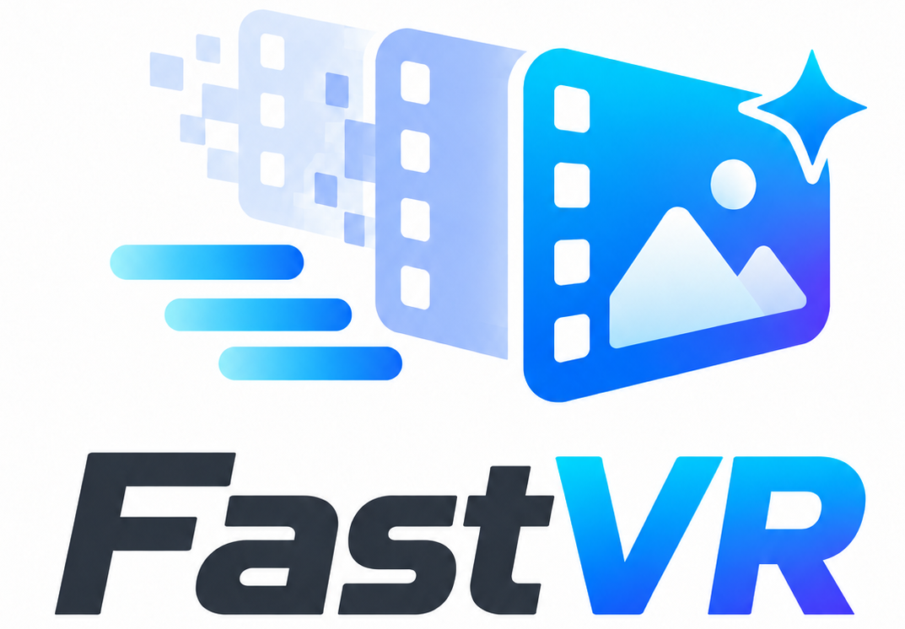
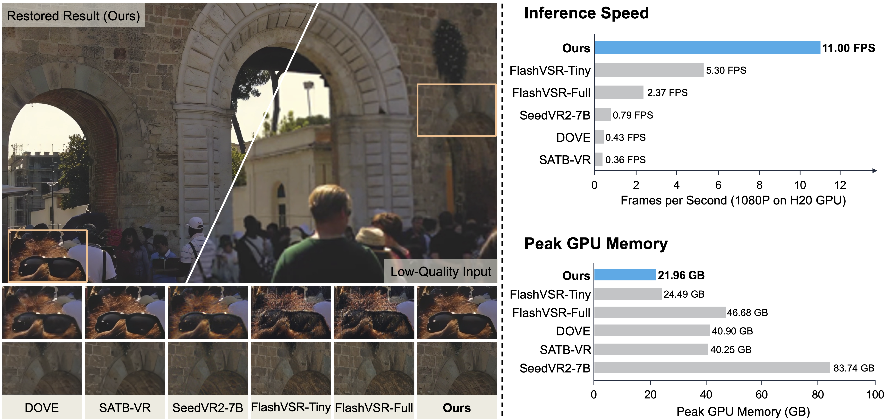
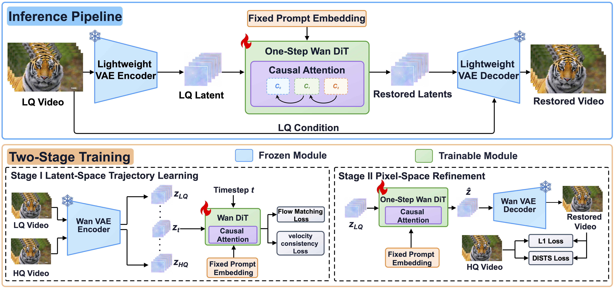

<div align="center">



# FastVR：基于单步扩散的高效流式视频修复

**[Xiaoxu Chen](https://scholar.google.com/citations?user=-jJkyWsAAAAJ&hl=zh-CN)<sup>1,∗</sup>, Qin Yang<sup>1,2,∗</sup>, [Haoran Bai](https://csbhr.github.io/)<sup>1</sup>, [Sibin Deng](https://scholar.google.com/citations?user=brmDxnsAAAAJ&hl=zh-CN)<sup>1</sup>, [Ying Chen](https://scholar.google.com/citations?user=NpTmcKEAAAAJ&hl=en)<sup>1,†</sup>**

<sup>1</sup>Alibaba Group &nbsp;&nbsp; <sup>2</sup>Xidian University<br>
<sup>∗</sup>Equal contribution &nbsp;&nbsp; <sup>†</sup>Corresponding author

[](https://chenxx89.github.io/projects/fastvr/)
[](https://huggingface.co/chenxx89/FastVR)
[](ComfyUI/README_zh.md)
[](LICENSE)
[](pyproject.toml)

[English](README.md) | [中文](README_zh.md)

</div>

<p align="center">
  <strong>FastVR 是一个基于单步扩散的视频修复框架，支持任意倍率超分辨率和长视频流式推理。</strong>
</p>

<div align="center">
  
</div>

## 🔥 最新消息

- **2026-09-29：** FastVR 技术报告和源代码正式发布。

<div align="center">
  
</div>

## 🎨 ComfyUI

FastVR 提供面向 ComfyUI `IMAGE` 视频帧批次的 `FastVR Model Loader` 和
`FastVR Video Enhancer` 节点。安装方式及 VideoHelperSuite 工作流说明见
[ComfyUI 集成文档](ComfyUI/README_zh.md)。

## 🔧 依赖与安装

1. 克隆仓库。

   ```bash
   git clone https://github.com/chenxx89/FastVR.git
   cd FastVR
   ```

2. 创建环境并安装依赖。FastVR 需要 Python 3.10 或更高版本以及支持 CUDA 的
   NVIDIA GPU。安装 FastVR 前，请先安装与本地 CUDA 环境匹配的
   [PyTorch](https://pytorch.org/get-started/locally/)。

   ```bash
   conda create -n fastvr python=3.10 -y
   conda activate fastvr

   pip install torch torchvision
   pip install -e .
   ```

3. 权重不包含在本仓库中。推理会自动下载 [FastVR 权重](https://huggingface.co/chenxx89/FastVR)
   至 `CKPT_PATH`；训练会自动下载 [Wan 权重](https://huggingface.co/Wan-AI/Wan2.2-TI2V-5B)
   至 `MODEL_BASE`。手动安装时，将两个 DiT 分片和 `vae.safetensors` 放入
   `CKPT_PATH`，无需合并分片。

   默认目录结构如下：

   ```text
   checkpoints/
   ├── FastVR/                       # 推理
   │   ├── dit-00001-of-00002.safetensors
   │   ├── dit-00002-of-00002.safetensors
   │   ├── vae.safetensors
   │   └── empty_prompt.pt           # 已包含在本仓库中
   └── Wan2.2-TI2V-5B/              # 仅训练
       ├── Wan2.2_VAE.pth
       ├── diffusion_pytorch_model-00001-of-00003.safetensors
       ├── diffusion_pytorch_model-00002-of-00003.safetensors
       └── diffusion_pytorch_model-00003-of-00003.safetensors
   ```

4. 推荐安装支持 `libx265` 的 [FFmpeg](https://ffmpeg.org/download.html)。如果无法
   通过 `PATH` 找到 FFmpeg，请设置其可执行文件路径：

   ```bash
   export FFMPEG_PATH=/path/to/ffmpeg
   ```

## 🚀 快速推理

### Shell 入口

编辑 `scripts/infer.sh` 顶部的 **User configuration** 区域，然后运行：

```bash
bash scripts/infer.sh
```

### 命令行

```bash
python3 -m fastvr.infer \
  --ckpt_path /path/to/FastVR \
  --input /path/to/input.mp4 \
  --output_dir outputs \
  --upscale 1 \
  --target_short_edge 1024 \
  --streaming \
  --enable_denoise_tiling
```

推荐用户编辑 Shell 脚本；直接进行命令行自动化时使用
`python3 -m fastvr.infer`。

### 参数

常用推理参数如下。

| 参数 | 说明 |
|---|---|
| `--input` | 视频、图片、JSONL、帧目录、视频目录或多个帧序列的根目录 |
| `--output_dir` | 输出目录，结果保留输入文件基本名称 |
| `--fps` | 单张图片或视频帧目录的输出帧率；视频文件沿用源帧率 |
| `--upscale` | 最终输出相对于源尺寸的倍率 |
| `--target_short_edge` | 模型处理短边，最终尺寸仍由 `--upscale` 决定 |
| `--streaming` | 开启有界端到端长视频流式处理 |
| `--save_formats` | 保存 `mp4`、`png` 或两种格式 |
| `--color_fix` | 可选 `adain` 或 `wavelet` 色彩校正 |

### 输入与输出

1. **输入**
   - 支持视频、图片、视频帧目录、视频目录、包含多个帧序列目录的根目录，以及
     JSONL 文件。
   - JSONL 中的 `Filepath` 可以指向视频、图片或视频帧目录；视频帧目录可以指定
     FPS：

     ```json
     {"Filepath": "/absolute/path/to/clip_frames", "Fps": 30}
     ```

   - 完整示例位于 `configs/data/inference.example.jsonl`。

2. **输出**
   - **文件名：** 保留输入文件的基础名称，并默认跳过已存在的结果。
   - **分辨率：** 按照 `--upscale` 确定的尺寸保存结果。
   - **FPS：** 视频保留源 FPS（包括非整数帧率）；单张图片和视频帧目录使用 `--fps`，默认 30。JSONL 的 `Fps` 优先。
   - **音频：** MP4 输出保留源视频中的可用音频。

### 分辨率与流式处理

- **`--upscale`：** 控制最终保存分辨率。源视频为 `W×H` 时，输出尺寸为
  `round(W×upscale) × round(H×upscale)`；`1` 表示同分辨率增强，`2` 表示输出
  2 倍分辨率。
- **`--target_short_edge`：** 只控制模型处理分辨率。输入保持宽高比缩放，默认短边
  为 `1024`，最终保存尺寸仍由 `--upscale` 决定。
- **`--streaming`：** 通过有界内存和异步 I/O 处理长视频，不改变分辨率和 FPS。
  `scripts/infer.sh` 默认开启，设置 `STREAMING=0` 可关闭。
- **`--enable_denoise_tiling`：** 通过空间分块降低峰值显存，不改变保存分辨率。

## 🏋️ 训练

1. 准备训练 JSONL。`Filepath` 必须是视频的绝对路径，`Start_Frame` 和
   `End_Frame` 为可选字段：

   ```json
   {"Filepath": "/absolute/path/to/example.mp4", "Start_Frame": 0, "End_Frame": 121}
   ```

   完整示例位于 `configs/data/train.example.jsonl`。

2. 编辑 `scripts/train_stage1.sh` 中的 **User configuration**，然后运行：

   ```bash
   bash scripts/train_stage1.sh
   ```

3. 选择包含两个 DiT 分片的 Stage 1 checkpoint 目录，在 `scripts/train_stage2.sh` 中设置
   `STAGE1_CHECKPOINT` 并更新其余路径，然后运行：

   ```bash
   bash scripts/train_stage2.sh
   ```

4. 模型权重保存至
   `OUTPUT/checkpoints/epoch-<epoch>-step-<step>/`，使用相同的两个 DiT 分片格式。
   将两个分片一起复制到推理权重目录即可使用训练结果。如需继续中断的
   训练，将对应训练 YAML 中的 `resume_from_checkpoint` 设置为 `training_states`
   的绝对路径：

   ```yaml
   resume_from_checkpoint: /absolute/path/to/output/training_states
   ```

## 📝 引用

如果 FastVR 对您的研究有帮助，请引用技术报告：

```bibtex
@misc{chen2026fastvr,
  title        = {FastVR: Efficient Streaming Video Restoration with One-Step Diffusion},
  author       = {Chen, Xiaoxu and Yang, Qin and Bai, Haoran and Deng, Sibin and Chen, Ying},
  year         = {2026},
  note         = {Technical report},
  url          = {https://chenxx89.github.io/projects/fastvr/}
}
```

## 🙏 致谢

FastVR 基于 [Wan2.2](https://github.com/Wan-Video/Wan2.2)、
[DiffSynth Studio](https://github.com/modelscope/DiffSynth-Studio) 以及
[RealBasicVSR](https://github.com/ckkelvinchan/RealBasicVSR) 的视频退化实践构建。
Stage 2 使用 [DISTS/pyiqa](https://github.com/chaofengc/IQA-PyTorch) 感知监督，
视频处理使用 [FFmpeg](https://ffmpeg.org/)。

## 📄 许可证

FastVR 代码采用 [Apache License 2.0](LICENSE)。第三方代码、依赖和 Wan2.2 基础
模型继续遵循各自许可证；重新分发或商业使用前请检查相应模型许可证。
